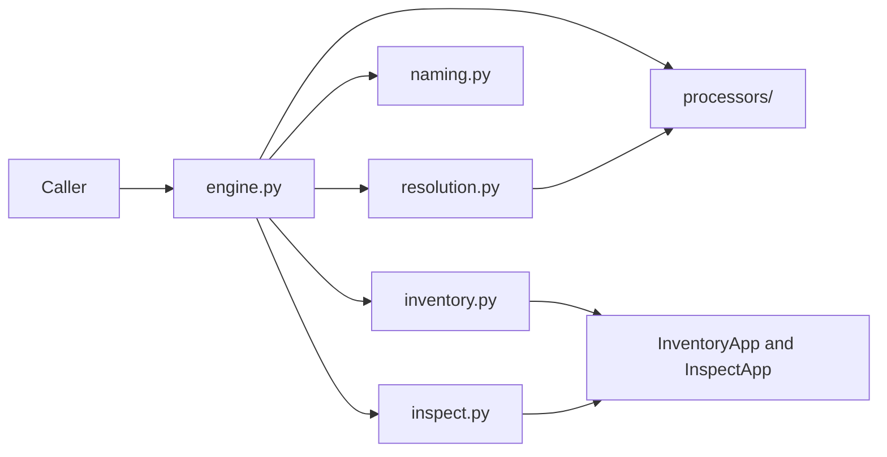
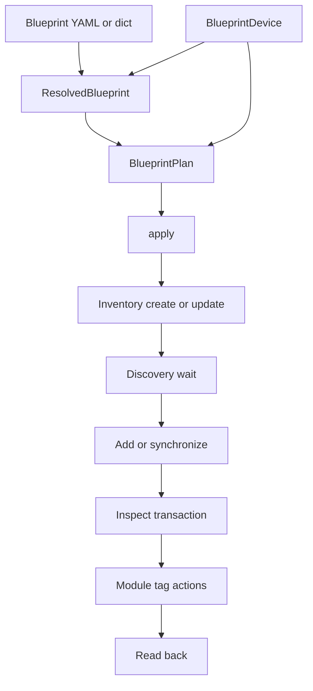

# Blueprints — Concepts

Design record for the shipped blueprint package. Field-level usage is in
[reference.md](./reference.md) and [processors.md](./processors.md).

## 1. What the feature is

Inventory onboards a device. Inspect places it in the topology and edits
vertices. A blueprint describes how one *kind* of device should be configured
in both places, so a caller can apply that description to many real devices.

The caller supplies the instance facts (`BlueprintDevice`): source-system id,
label, addresses, credentials, an optional Inventory id, and an optional
Inspect target. The blueprint supplies the type: driver settings, topology
appearance, vertex interpretation, and naming. The engine does not know NetBox
or any other source system. Translation into `BlueprintDevice` stays outside
the package.

`plan()` reads current server state and returns a reviewable `BlueprintPlan`.
`plan.apply()` writes. The two calls share one executor. `engine.apply(...)`
is `plan` followed by `apply`.

## 2. Dependency direction

Document models, naming, and processors do not call VideoIPath. The only
modules that touch `app.inventory` and `app.inspect` are the two gateways
([ADR-005](./decisions/005-app-gateways.md)). `VideoIPathApp` does not depend
on this package at all.

`BlueprintEngine` is constructed with a `BlueprintApp` protocol (`inventory`
and `inspect` properties). `VideoIPathApp` satisfies that protocol without
being imported here. Construction does not touch the app or the network.

PyYAML is a normal package dependency. The parser lives in `loader.py`.
`models.py` imports it for `Blueprint.load` / `from_yaml`, so importing
`Blueprint` imports PyYAML. The parser is a dedicated `SafeLoader` subclass:
one UTF-8 document, mapping root, no duplicate keys, aliases, anchors, merge
keys, or custom tags. Limits are 1 MiB, 32 levels, and 100,000 nodes.

## 3. Module map

| Module | Responsibility |
| ------ | -------------- |
| `models.py` | Strict document, device facts, patches, plan and result records. |
| `loader.py` | YAML parsing and source locations for errors. |
| `resolution.py` | Variant merge, driver and parameter validation, JSON Schema. |
| `naming.py` | `Text` / `Field` / `Join` expressions and layering. |
| `processors/` | `VertexProcessor`, detached records, per-engine `ProcessorRegistry`, Matrox built-in. |
| `inventory.py` | `InventoryGateway`: one Inventory record, managed-field diff, create/update. |
| `inspect.py` | `InspectGateway`: fresh scoped read, processor run, topology commit, module tags. |
| `engine.py` | Configuration, `plan()`, captured inputs, phased `apply()`. |
| `errors.py` | `BlueprintError` hierarchy. Validation issues carry a path, not raw values. |
| `schemas/blueprint-v1.schema.json` | Generated document schema. `tests/blueprints/test_resolution.py` fails when the file is stale. |

Public types are re-exported from `blueprints/__init__.py`. Engine internals
(`_Planner`, `_Executor`, `_Captured`, the gateways' work models) are not.

## 4. From document to writes

Resolution ([ADR-006](./decisions/006-variant-merge.md)) selects `inventory` and
`topology` independently. A missing section is skipped. The selected named
entry patches `default`, then per-instance `inventory_overrides` patch the
inventory section. Driver `custom_settings` are checked against the driver
model for `SELECTED_SCHEMA_VERSION`. Processor `params` are checked against
the registered `params_model`. The source document is not mutated. Every merged
leaf keeps a provenance string (`default`, `variant:<name>`, `instance`) so a
plan can say where a value came from.

Naming is layered after that, entry by entry, later sources winning:
library default, engine `naming`, resolved blueprint naming (a topology entry
replaces the same inventory entry), then the `naming` argument on the call. An explicit
`None` turns that entry off. Names are rendered from facts on `BlueprintDevice`,
`module_position`, `EndpointIdentity`, and scalar `attributes`. They are not
read off the current server label, so a second apply cannot grow a second suffix.

## 5. Planning

`plan()` deep-copies the device, the blueprint, and the processor registry, and
stores them on the plan together with the resolved document, the layered naming
scheme, and the effective `ApplyOptions`. Later `engine.configure(...)` or
`register_processor(...)` does not change a plan that already exists.

Planning reads. It does not write, synchronize, stage snapshot edits, or create
catalog tag entries.

Inventory planning compares managed fields with the current record
([ADR-003](./decisions/003-managed-fields.md)) and records a create, an update,
or no change. A supplied `inventory_id` that does not exist fails. The engine
does not create a replacement record.

Topology planning needs a target. That is `BlueprintDevice.topology`, or a
`DeviceTarget` built from `inventory_id` when topology was omitted. When the
exact edits cannot be known yet, the topology phases are marked `deferred` and
`fully_resolved` is `False`. That happens when:

- this plan creates the Inventory record the topology device id will come from
- planned Inventory changes may alter discovery (address, alternate addresses,
  credentials, generic settings, custom settings, or `active`)
- the device is not in the topology yet and `sync` allows adding it
- synchronization is pending and this target is allowed to perform it

A module target does not add or synchronize its parent device. If the parent is
absent, planning fails. If a sync is pending, the plan warns and continues
against the current topology.

When nothing is deferred, planning reads a detached scope
([ADR-005](./decisions/005-app-gateways.md)), runs the processor
([ADR-004](./decisions/004-processors-propose.md)), and stores the exact edits
plus a fingerprint of the scope.

The public plan fields (phases, bindings, diagnostics, digest, ids) are the
review surface. `summary()` redacts secrets. `apply()` also uses private
captured work, including unredacted Inventory values, so a plan is an in-memory
object bound to the app it was built with. It is not a document you save and
replay in another process.

## 6. Applying

[ADR-002](./decisions/002-plan-then-apply.md) fixes the phase order:

1. `inventory` — create or update the one record. A new id is stored on the result immediately.
2. `discovery` — poll until the scoped topology can be interpreted, bounded by `discovery_timeout` (default 30 seconds, poll every 1 second).
3. `topology_sync` — add the device or synchronize it, according to `ApplyOptions.sync`.
4. `topology` — device and vertex edits in one `InspectTransaction`, then commit.
5. `module_tags` — `assignTag` / `unassignTag` actions, one tag at a time. These are not part of the topology commit.
6. `verification` — read back what this apply wrote.

`sync` defaults to `add_only`. `none` requires the device to already be in the
topology. `add_only` adds the device and synchronizes new elements; if the
pending sync would update or remove elements, apply fails instead of escalating.
`reconcile` allows a full sync. The gateway calls `sync_devices` without a
conflict strategy, so Inspect's default `ConflictStrategy.STRICT` applies.
A module target never reaches this add/sync path.

Unchanged phases are skipped. An apply that would change nothing writes nothing.

`dry_run=True` runs the same stale-plan, conflict, and pending-edit checks, then
returns before any write. Deferred topology stays `deferred` on a dry run,
because those edits depend on writes the dry run does not perform. `status` is
`planned` when writes would have run, and `no_change` otherwise.

Before an Inventory update, the gateway re-reads the record and compares
fingerprints of the managed fields. Before a topology commit that was fully
resolved at plan time, it re-reads the scope and compares the fingerprint,
including sibling endpoint labels that the collision check depends on.
Module tags are re-read immediately before their phase. Pending uncommitted
Inspect edits that overlap the plan's device, vertices, or module are rejected.
The Inspect transaction then does its own baseline check. These checks are
client-side. A short gap between the read and the write remains.

If a later phase fails, earlier phases stay applied. `BlueprintApplyError.result`
is `partial` when something was written, `failed` when nothing was, and
`unknown` when a write raised and the client cannot prove the server rejected
it (`InspectCommitError`, `InspectCommitConflictError`, `BlueprintError`, and
known Inventory `ValueError` messages count as known rejections, including a
failed re-read that happens before `update_device` sends the update). A failed
synchronization lookup is also an error; it is not treated as "nothing pending".
Verification does not roll a write back. A mismatched or failed read-back, or a
later phase that fails before the topology read-back runs, sets `verification`
to `unconfirmed` and leaves the writes in place.

## 7. What stays outside

The package does not select a processor from the driver id, prune configuration
it used to manage, roll back a partial apply, migrate drivers, infer cables, or
provision services. Catalog tags are referenced by id and are not created.
Endpoint label uniqueness is checked per device, including endpoints outside
the changed set, and not across the system. `ApplyOptions(naming_collisions="allow")`
is the escape hatch. Names are not truncated or given a numeric suffix.

Offline tests under `tests/blueprints/` drive the engine with fakes. Live
behavior of the writes still has to be checked on a test system.
