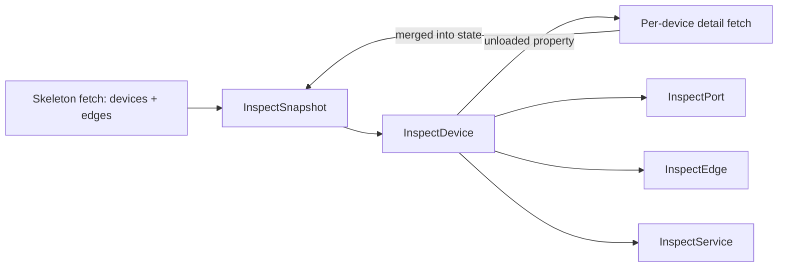
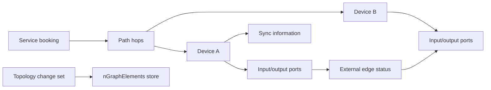
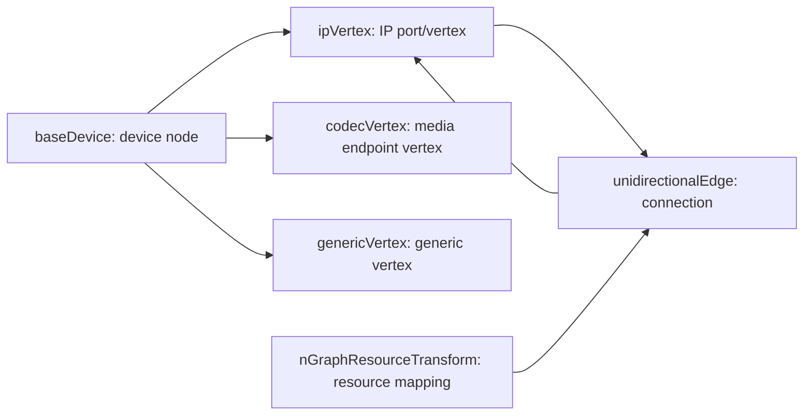

# Inspect App Data Model

This document describes Inspect data as package users should think about it:
services, devices, ports, edges, status, and topology changes.

The implementation uses two layers:

- **Transport DTOs** in `src/videoipath_automation_tool/apps/inspect/model/` mirror
  HTTP request and response payloads. These classes are prefixed with `InspectApi`
  and are intended for direct API communication and parsing.
- **Domain models** in `src/videoipath_automation_tool/apps/inspect/domain/` are
  the objects package users work with: `InspectDevice`, `InspectPort`,
  `InspectEdge`, and `InspectService`. They are built from an `InspectSnapshot`
  and resolve relations from internal indexes instead of making extra HTTP calls.

`InspectSnapshot` is an **internal** component: `InspectApp` owns a single instance,
builds it lazily on the first read, and keeps it current across writes. Users never
construct or hold it — all reads and writes go through `app.inspect` (`get_device`,
`devices`, `edges`, `services`, `refresh`, …), the same way as the other apps.

Wire-shape examples and endpoint references live in
[endpoints.md](./endpoints.md). All examples below are anonymized.

## Two Layers



A snapshot is built **skeleton-first**
([ADR-0007](./decisions/0007-lazy-snapshot-loading.md)): two parallel scoped
collector queries load all devices (without modules/ports) and all external
edges (lean projection). Detail is **lazily hydrated** — accessing an unloaded
property fetches that one device's full `nodeStatus` subtree (or, for
services, the `inspect/paths` section once) and merges it into the snapshot's
internal state. The concrete queries are documented in
[endpoints.md](./endpoints.md#collector-scoped-queries-captured-from-the-inspect-ui).

Typical read flow:

```python
device = app.inspect.get_device("device-a")    # loads the internal view lazily; skeleton-backed
ports = device.ports          # first access: hydrates device-a, then local
edges = device.edges          # local: edge skeleton
services = device.services    # first access: loads the paths section, then local
linked = device.linked_devices

port = ports[0]
if port.edge is not None:
    peer = port.edge.to_device
    peer_port = port.edge.to_port
```

Relation getters resolve full domain objects from snapshot indexes. Repeated
access returns the same cached instance for a given device, port, edge, or
service.

The loading contract:

- A getter performs **at most one hydration fetch** per entity (device
  subtree) or section (services, maintenance bookings, …); after that, access
  is local. Hydrated data is merged into the same snapshot state and indexes.
- Because hydration is HTTP, touching an unloaded property can add latency and
  raise connector errors — this is deliberate, documented behaviour.
- Iterating detail over many devices hydrates one device per iteration (N+1);
  use bulk preload helpers (e.g. `snapshot.preload_devices(...)` /
  `get_devices(detail=True)`) for that pattern.
- The snapshot is **not** a single point in time: skeleton and hydrated
  subtrees carry their own fetch timestamps.

Refresh data by building a new snapshot; the state accretes within one
snapshot's lifetime but is never reused across snapshots.

## Mental Model

Inspect is built from two data surfaces:

- A **collector snapshot** describes what the Inspect UI can show right now:
  services, path hops, devices, ports, external edges, sync hints, and status.
- A **topology change set** describes what the client wants to commit to the
  persisted graph store.



## Collector Snapshot

The collector response is a REST v2 envelope with a `header` and a `data` object.
The useful Inspect content is under `data.status.collector`.

```json
{
  "data": {
    "status": {
      "collector": {
        "inspect": {
          "paths": { "_items": [] },
          "nodeStatus": { "_items": [] }
        },
        "externalEdgesByDeviceKey": { "_items": [] },
        "maintenanceBookings": { "_items": [] },
        "superProfiles": { "_items": [] },
        "tagInfo": { "_items": [] }
      }
    }
  },
  "header": {
    "auth": true,
    "caption": "Operation Successful",
    "code": "OK",
    "id": "",
    "msg": [],
    "ok": true,
    "user": "api-user"
  }
}
```

VideoIPath collections use `_items`. Transport DTOs preserve that wire shape.
`InspectSnapshot` indexes the skeleton data at construction and extends its
indexes incrementally as entities and sections are hydrated. Scoped queries
return the same wire shapes as the full aggregate, just filtered/projected —
one set of DTOs covers both (skeleton items simply have `modules: {}` and
omitted fields).

## Loaded vs. Unloaded State

The snapshot tracks, per device and per section, whether detail has been
hydrated and when it was fetched.

| Data | Backing | Loaded when |
| --- | --- | --- |
| Device identity, `label`, `pid`, `coordinates`, icon/meta, `status`, `sync_severity`, `tags` | Device skeleton query | Snapshot construction |
| Edge connectivity, endpoint ports/labels, status severities | Edge skeleton query | Snapshot construction |
| Device `ports` (modules, port status, `vertexInfo`, port `tagsInfo`, PTP), port-level path drill-down | Per-device `nodeStatus` subtree (`modules/*` projection) | First access on that device |
| `services`, service path structures | `inspect/paths` section query | First access to any service data |
| Active alarms (`.alarms`, `status_message`) | `status/alarms/current` section query | First access to any alarm data |
| Maintenance bookings, super profiles, tag info | Section queries | First access, if exposed |
| Edge bandwidth values, edge `pathDescriptions` | Full per-pair edge shape | Not in the skeleton; loaded with the owning section/entity detail |

An eager snapshot (`load="full"`, one `GET …/collector/**`) starts fully
hydrated; fixture-built snapshots used in offline tests behave the same, with
lazy loading inert.

## User-Facing Domain Objects

These are the classes package users should prefer for read-side workflows.

### Status severity (`InspectSeverity`)

Status and alarm severity fields (`status.severity`, `status.sa`, `sync_severity`,
edge live `alarm` / `ptp` / `maintenance` / `bandwidth`) are mapped to
`InspectSeverity`, an `IntEnum` so both the label and the wire int remain usable:

| Value | Label |
| --- | --- |
| `0` | None |
| `1` | OK |
| `2` | Notice |
| `3` | Warning |
| `4` | Minor |
| `5` | Major |
| `6` | Critical |

```python
device.status.severity          # InspectSeverity.OK
str(device.status.severity)      # "OK"
int(device.status.severity)      # 1
device.status.severity == 1      # True
```

Unknown wire codes pass through as raw `int` / `str` (never crash).

### Active alarms (`InspectAlarm`)

Per-resource alarm messages come from `status/alarms/current` (loaded lazily as a
snapshot section). Each of `device` / `module` / `port` / `edge` / `service` exposes
`.alarms` — a list of `InspectAlarm` sorted worst-severity first. Device also has
`status_message` (the worst alarm's text).

| Field / property | Meaning |
| --- | --- |
| `message` | Alarm text (e.g. `"Mock driver in use"`, `"Loss of protection"`) |
| `severity` / `sa` | Mapped `InspectSeverity` |
| `acknowledged` / `hidden` | Alarm acknowledgement flags |
| `point_labels` | Human labels for the alarm's point path |
| `alert_id` / `component` | Alarm identity |

### `InspectDevice`

Represents one topology device/node with status, sync hints, and relations.

| Field / property | Meaning |
| --- | --- |
| `id` | Device identifier, for example `device-a` |
| `label` | Display label |
| `status` | Device status summary (`sa` / `severity` as `InspectSeverity`) |
| `sync_severity` | Sync severity from node status (`InspectSeverity`) |
| `alarms` | Active alarms on this device (worst first) |
| `status_message` | Message of the worst active alarm, if any |
| `tags` | Assigned tags |
| `coordinates` | Topology map position when available |
| `ports` | Ports on this device |
| `edges` | External edges touching this device |
| `services` | Services whose path includes this device |
| `linked_devices` | Neighbour devices via edges or shared service paths |

Lookup:

```python
device = app.inspect.get_device("device-a")
matches = app.inspect.find_devices_by_label("Example Device A")
print(device.status.severity, device.status_message)
for alarm in device.alarms:
    print(alarm.severity, alarm.message)
```

### `InspectPort`

Represents one module port with status, optional vertex linkage, and an optional
external edge to another device.

| Field / property | Meaning |
| --- | --- |
| `id` | Port pid |
| `label` | Display label |
| `device` | Owning `InspectDevice` |
| `module_id` | Owning module |
| `status` | Port status summary (`InspectSeverity` fields) |
| `alarms` | Active alarms correlated to this port |
| `vertex_id` | Linked topology vertex when available |
| `tags` | Vertex tag bindings when hydrated (`tagsInfo` from `nodeStatus`) |
| `edge` | External edge when this port connects to another device; otherwise `None` |

### `InspectEdge`

Represents one external edge status entry between two endpoint devices/ports.

| Field / property | Meaning |
| --- | --- |
| `id` | Edge identifier |
| `from_device` / `to_device` | Endpoint devices |
| `from_port` / `to_port` | Endpoint ports |
| `bandwidth` / `max_bandwidth` | Bandwidth values |
| `status` | Alarm, bandwidth, maintenance, and PTP summary (`InspectSeverity`) |
| `alarms` | Active alarms correlated to this edge / pair |
| `services` | Services touching either endpoint device |

### `InspectService`

Represents one service/booking path across devices and ports.

| Field / property | Meaning |
| --- | --- |
| `booking_id` | Booking identifier |
| `label` | Service label when available |
| `source` / `destination` | Endpoint labels |
| `source_device` / `destination_device` | Endpoint devices |
| `source_port` / `destination_port` | Endpoint ports |
| `status` | Service status summary (`InspectSeverity` fields) |
| `alarms` | Active alarms correlated to this booking |
| `path_devices` | Ordered devices in the path |
| `path_ports` | Ports encountered in the path |

Lookup:

```python
service = snapshot.get_service_by_booking_id("booking-1001")
all_services = snapshot.get_services()
```

## Transport DTO Examples

A path item links one service or booking to the devices and ports used to carry
it. This is the best starting point when a caller wants to answer: "Which devices
does this service traverse?"

```json
{
  "_id": "booking-1001::main",
  "_vid": "_:booking-1001::main",
  "serviceFields": {
    "bid": "booking-1001",
    "from": "endpoint-a",
    "fromLabel": "Example Source",
    "fromPid": "endpoint-a-pid",
    "to": "endpoint-b",
    "toLabel": "Example Destination",
    "toPid": "endpoint-b-pid",
    "isMain": true,
    "serviceStatus": {
      "config": { "sa": 0, "severity": 0 },
      "total": { "sa": 0, "severity": 0 }
    }
  },
  "path": [
    {
      "bid": "booking-1001",
      "ipDesc": "<multicast-address>:<port>",
      "structure": {
        "deviceId": "device-a",
        "devicePid": "device-a",
        "deviceLabel": "Example Device A",
        "expectConfig": true,
        "inputStatus": {
          "pid": "port-a-in",
          "label": "Input Port",
          "context": {
            "devicePid": "device-a",
            "modulePid": "module-a",
            "portPid": "port-a-in"
          },
          "status": { "sa": 0, "severity": 0 }
        },
        "outputStatus": {
          "pid": "port-a-out",
          "label": "Output Port",
          "context": {
            "devicePid": "device-a",
            "modulePid": "module-a",
            "portPid": "port-a-out"
          },
          "status": { "sa": 0, "severity": 0 }
        },
        "moduleAndDeviceStatus": { "sa": 0, "severity": 0 }
      }
    }
  ]
}
```

In Python this maps to `InspectApiPathItem`, `InspectApiPathServiceFields`,
`InspectApiPathSegment`, and `InspectApiPathStructure`.

## Devices, Modules, And Ports

Node status describes a device-like node as the Inspect UI sees it. It can
include coordinates, modules, ports, status, tags, sync severity, and embedded
references back to service paths.

```json
{
  "_id": "node-device-a",
  "_vid": "_:node-device-a",
  "deviceId": "device-a",
  "pid": "device-a",
  "label": "Example Device A",
  "meta": {
    "coordinates": { "x": 500, "y": 8150 }
  },
  "status": { "sa": 0, "severity": 0 },
  "syncSeverity": 0,
  "tags": ["#example-tag"],
  "modules": {
    "module-a": {
      "_id": "module-a",
      "pid": "module-a",
      "label": "Example Module",
      "status": { "sa": 0, "severity": 0 },
      "ports": {
        "port-a-out": {
          "_id": "port-a-out",
          "pid": "port-a-out",
          "label": "Output Port",
          "status": { "sa": 0, "severity": 0 },
          "vertexInfo": {
            "type": "single",
            "id": "vertex-a-out",
            "label": "Output Vertex",
            "vertexType": "ip",
            "fields": {
              "isActive": true,
              "isControlled": true,
              "isEndpoint": false
            }
          }
        }
      }
    }
  }
}
```

In Python this maps to `InspectApiNodeStatusItem`, `InspectApiModuleStatus`,
`InspectApiPortStatus`, `InspectApiSingleVertexInfo`, and `InspectApiDoubleVertexInfo`.

## External Edges

External edge status groups live connectivity between two devices. Each group has
two sides, and each side can contain one or more edge entries keyed by edge ID.

```json
{
  "_id": "device-a::device-b",
  "_vid": "device-a::device-b",
  "primary": {
    "devicePid": "device-a",
    "label": "Example Device A",
    "data": {
      "edge-a-b-0001": {
        "id": "edge-a-b-0001",
        "bandwidth": 1000,
        "maxBandwidth": 10000,
        "ratio": 0.1,
        "fromStatus": {
          "pid": "port-a-out",
          "label": "Output Port",
          "status": { "sa": 0, "severity": 0 }
        },
        "toStatus": {
          "pid": "port-b-in",
          "label": "Input Port",
          "status": { "sa": 0, "severity": 0 }
        },
        "status": {
          "alarm": 0,
          "bandwidth": 0,
          "maintenance": 0,
          "ptp": 0
        }
      }
    }
  },
  "secondary": {
    "devicePid": "device-b",
    "label": "Example Device B",
    "data": {}
  },
  "status": {
    "alarm": 0,
    "bandwidth": 0,
    "maintenance": 0,
    "ptp": 0
  }
}
```

In Python this maps to `InspectApiExternalEdgesByDeviceKeyItem`,
`InspectApiExternalEdgeSide`, `InspectApiExternalEdgeStatus`, and
`InspectApiExternalEdgeLiveStatus`.

## Lookup And Sync Actions

Action endpoints return focused views for UI workflows.

`lookupInspectDevice` returns editable/display fields for one device:

```json
{
  "data": {
    "assignedTags": {
      "all": [],
      "inherited": {},
      "inheritedConflict": false,
      "local": {}
    },
    "fields": {
      "coordinates": { "x": 500, "y": 8150 },
      "descriptor": {
        "desc": "Example device description",
        "label": "Example Device A"
      },
      "iconSize": "medium",
      "iconType": "gateway",
      "localAssignedTags": [],
      "sdpStrategy": "always",
      "siteId": null,
      "tags": ["#example-tag"],
      "virtualDeviceFields": null
    }
  }
}
```

`lookupInspectVertexByIds` returns the editable vertex form, including **vertex
tag bindings** (not available from `nGraphElements` or `app.topology`):

```json
{
  "data": {
    "device-a.module-1.port-out-1.out": {
      "assignedTags": {
        "all": ["#example-tag"],
        "inherited": {},
        "inheritedConflict": false,
        "local": { "#example-tag": { "label": "#example-tag", "path": [] } }
      },
      "context": {
        "devicePid": "device-a",
        "modulePid": "device-a.dev.module-1",
        "portPid": "device-a.dev.module-1.port-out-1"
      },
      "fields": {
        "label": "Port A (out)",
        "localAssignedTags": ["#example-tag"],
        "tags": ["#example-tag"],
        "typeFields": { "type": "ip" }
      },
      "id": "device-a.module-1.port-out-1.out",
      "vertexType": "Out"
    }
  }
}
```

This is the stage-time baseline for vertex tag fields in compare-and-commit
([ADR-0009](./decisions/0009-write-consistency.md)).

`lookupSyncInfo` returns per-device sync differences:

```json
{
  "data": {
    "device-a": {
      "add": {},
      "label": "Example Device A",
      "remove": {},
      "severity": 0,
      "update": {}
    }
  }
}
```

`addDevices` and `syncDevices` use the same normal action-result shape when the
action runs:

```json
{
  "data": {
    "msg": [],
    "ok": true
  },
  "header": {
    "auth": true,
    "caption": "Operation Successful",
    "code": "OK",
    "id": "0",
    "msg": [],
    "ok": true,
    "user": "api-user"
  }
}
```

Some invalid `addDevices` requests can be rejected before an action result is
returned. Those responses contain only the REST header with validation details.

## Persisted Topology Graph

The collector snapshot is a status view. Committed Inspect topology data is stored
in `config.network.nGraphElements._items[]`. Each item has an ID, optional
revision, display descriptors, and a `type` value that tells callers which
shape to parse.

> **Vertex tags are not persisted here.** Device-level tags live on `baseDevice`
> items, but bindings of tags to individual vertices (`ipVertex`, `codecVertex`,
> …) are stored server-side in `videoipath_docs.device_tags`, not in the
> `ngraph` / `nGraphElements` store. `app.topology` therefore has no vertex-tag
> concept. Inspect reads vertex tags from hydrated port `tagsInfo` in
> `nodeStatus` and from `lookupInspectVertexByIds` (`assignedTags`,
> `fields.tags`, `fields.localAssignedTags`) — see
> [concepts.md §3.4](./concepts.md#34-tagging--device-vs-vertex-inspect-vs-topology).
> A `tags` field may appear on vertex elements in `nGraphElements` wire examples
> but is not the authoritative store for vertex tag bindings.



Example persisted graph elements:

```json
[
  {
    "_id": "device-a",
    "_vid": "device-a",
    "_rev": "1-example-revision",
    "type": "baseDevice",
    "descriptor": {
      "label": "Example Device A",
      "desc": "Example device description"
    },
    "fDescriptor": {
      "label": "Example Device A",
      "desc": "Example device description"
    },
    "iconSize": "medium",
    "iconType": "gateway",
    "isVirtual": false,
    "maps": [],
    "sdpStrategy": "always",
    "siteId": null,
    "tags": ["#example-tag"]
  },
  {
    "_id": "vertex-a-out",
    "_vid": "vertex-a-out",
    "type": "ipVertex",
    "deviceId": "device-a",
    "descriptor": { "label": "Output Vertex", "desc": "" },
    "fDescriptor": { "label": "Output Vertex", "desc": "" },
    "gpid": {
      "component": 1,
      "pointId": ["device-a", "module-a", "port-a-out"]
    },
    "ipAddress": "198.51.100.10",
    "ipNetmask": "255.255.255.0",
    "supportsIgmpCfg": true,
    "tags": []
  },
  {
    "_id": "edge-a-b-0001",
    "_vid": "edge-a-b-0001",
    "type": "unidirectionalEdge",
    "fromId": "vertex-a-out",
    "toId": "vertex-b-in",
    "active": true,
    "bandwidth": -1,
    "capacity": 65535,
    "redundancyMode": "Any",
    "weight": 0,
    "weightFactors": {
      "bandwidth": { "weight": 0 },
      "service": { "max": 100, "weight": 0 }
    },
    "tags": []
  }
]
```

In Python these shapes live in `ngraph.py`.

## Committing Changes

`updateTopology` sends the whole change set in one request. Empty maps/lists are a
valid no-op. Non-empty maps upsert graph elements by ID, `addExternalEdges` adds
edge objects, and `remove` deletes graph elements by ID.

The per-kind payload shapes differ (all verified 2025.4.9,
[endpoints.md](./endpoints.md#post-restv2actionsstatuscollectorupdatetopology)):
**devices use the edit form** (`lookupInspectDevice.fields`; `coordinates` and
`localAssignedTags` are mandatory — the raw persisted `baseDevice` element is
rejected), **vertices use the edit form** (`lookupInspectVertexById.fields`)
and are **update-only** (unknown ids fail validation — vertices come from
device sync, not commits), and **edges use the raw persisted edge form**
(`lookupInspectEdgesByIds` returns it directly).

```json
{
  "header": { "id": 0 },
  "data": {
    "replaceDevices": {
      "device-a": {
        "coordinates": { "x": 1600.0, "y": 9050.0 },
        "descriptor": { "label": "", "desc": "" },
        "iconSize": "medium",
        "iconType": "default",
        "localAssignedTags": [],
        "sdpStrategy": "always",
        "siteId": null,
        "tags": [],
        "virtualDeviceFields": null
      }
    },
    "replaceVertices": {},
    "replaceEdges": {
      "device-a.module-1.port-out-1.out::device-b.module-1.port-in-1.in": {
        "active": true,
        "bandwidth": -1.0,
        "capacity": 65535,
        "conflictPri": 0,
        "descriptor": { "label": "", "desc": "" },
        "excludeFormats": [],
        "fDescriptor": { "label": "", "desc": "" },
        "fromId": "device-a.module-1.port-out-1.out",
        "includeFormats": [],
        "redundancyMode": "Any",
        "tags": [],
        "toId": "device-b.module-1.port-in-1.in",
        "weight": 1,
        "weightFactors": {
          "bandwidth": { "weight": 0 },
          "service": { "max": 100, "weight": 0 }
        }
      }
    },
    "replaceResourceTransforms": {},
    "addExternalEdges": [],
    "remove": [],
    "force": false
  }
}
```

A commit is successful only when all three success flags are true:

```python
response.header.ok and response.data.res.ok and response.data.validation.result.ok
```

Validation failures can still arrive with `header.ok == true`, so callers must
inspect `data.res`, `data.validation.result`, and `data.validation.details`.

### Consistency Against Concurrent Writers

`updateTopology` enforces no revisions (last-writer-wins), `replace*` entries
are full-object upserts, and collector reads carry no `_rev` — so the change
set protects callers itself
([ADR-0009](./decisions/0009-write-consistency.md)):

- **Staging an entity fetches its baseline**: the current form, read via
  Inspect-surface lookups (`lookupInspectDevice` for devices,
  `lookupInspectVertexByIds` for vertices, `lookupInspectEdgesByIds` for edges
  — the latter returns the full persisted edge form, batched; see
  [endpoints.md](./endpoints.md#post-restv2actionsstatuscollectorlookupinspectedgesbyids)).
  The caller's mutations are applied on top of the baseline, so the committed
  payload never clobbers fields built from stale state.
- **`commit()` re-checks before posting**: the touched entities are re-read
  and compared against their baselines; any third-party change aborts the whole
  commit with a typed conflict error (entity ids + field diffs). Skipping the
  check is an explicit opt-in (deliberate last-writer-wins).
- The check is **detection, not enforcement** — a small race window between
  re-read and POST remains; the server offers nothing stronger on the Inspect
  surface.

Snapshot data is never used as a baseline — it is a read projection without
revisions, possibly stale by design (lazy hydration).

### Snapshot Refresh After a Commit

A successful commit leaves the caller's `InspectSnapshot` stale exactly where
the change set touched it. Instead of a full re-snapshot (~MBs), the snapshot
catches up with **targeted scoped re-reads**
([ADR-0010](./decisions/0010-post-commit-snapshot-refresh.md)):

- removed entities are dropped from the indexes locally;
- affected devices and edge pairs (derived from the change-set keys and the
  commit response `items[]`) are re-fetched with the same per-device /
  per-pair queries the lazy-hydration path uses, replacing their records and
  fetch timestamps;
- loaded sections (e.g. services) are marked stale and re-load lazily on next
  access;
- the collector projection updates effectively synchronously with the commit
  (measured ~25 ms to visibility on 2025.4.9), so the targeted re-read doubles
  as the verification — no retry loop.

A failed commit changes nothing server-side (reject-before-apply), so the
snapshot is left untouched.

## Python Module Layout

Transport DTOs are split by payload area under `apps/inspect/model/`:

- `common.py` — shared envelopes, descriptors, status summaries, action wrappers
- `collector.py` — collector snapshot wire models
- `ngraph.py` — persisted `nGraphElements` wire models
- `actions.py` — lookup/add/sync action request and response DTOs
- `update_topology.py` — `updateTopology` change-set and commit response DTOs

User-facing read models live alongside the snapshot:

- `snapshot.py` — `InspectSnapshot` and internal indexes
- `domain/device.py` — `InspectDevice`
- `domain/port.py` — `InspectPort`
- `domain/edge.py` — `InspectEdge`
- `domain/service.py` — `InspectService`

When adding transport fields, prefer extending the nearest existing `InspectApi*`
DTO. When adding user-facing behaviour, extend the domain layer and snapshot
indexes instead of exposing raw HTTP nesting to callers.
