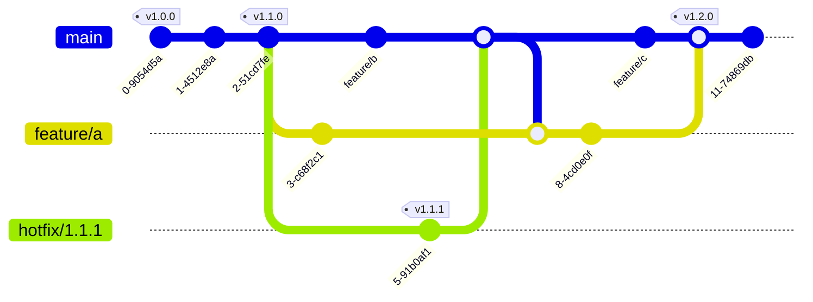
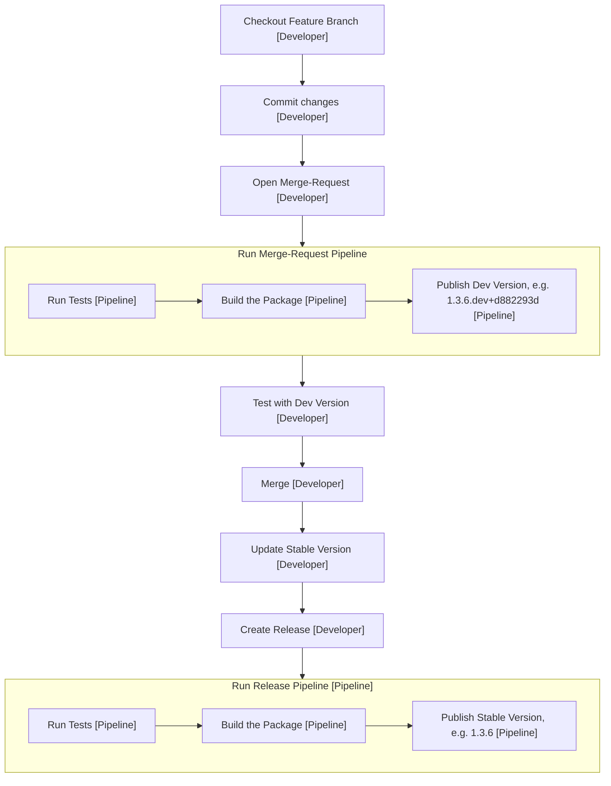

# Development and Release

## Naming Conventions

Work on a branch should always be related to an issue. The branch should be linked to the issue to have full transparency and traceability. The branch name can be the auto-generated one from GitHub (when creating a branch for an issue) or a custom one - preferably including the issue ID.

In order to trigger CI/CD flows properly and for transparency, **hotfix**-branches should always have the `hotfix/` prefix so we can have a custom automation for this case.

Commits messages should briefly describe the changes they're introducing but don't have a strict naming format or convention.

## Versioning

For versioning, mostly [semantic versioning](https://semver.org/) is used. Unfortunately, Python doesn't understand all details of semver, but it's
still the most viable solution and the basics can be used.

For stable/official versions, the common semver pattern is used:

- **Major** releases (5.0.0) indicate changes that will be incompatible with previous versions.
- **Minor** releases (5.1.0) add functionality while still being backward-compatible (in this example 5.1.0 would be compatible with 5.0.0).
- **Patch** (often termed Micro in Python) releases are minor bug fixes or security patches that should always be backward compatible (5.1.4).

For development versions, there are multiple options - since this package doesn't have a complex testing and verification process for release,
a simple format is used:

`<Major>.<Minor>.<Patch>.dev+<short commit SHA>`

Pip won't treat those versions as stable, they can only be installed by specifying the exact version or using the `--pre` flag.

## Git Flow

## Publishing / Releasing new Package Versions

In order to publish a new version of the package, update the version in the `pyproject.toml` and create a new GitHub Release associated with a version tag. The release notes should contain all relevant changes, especially breaking changes, features & bug fixes.

The CI/CD pipeline listens on created tags and builds an publishes a new package version to the registry. Additionally, for each commit in a Merge-Request or on the main and hotfix branches that is not a release, development versions are published.

