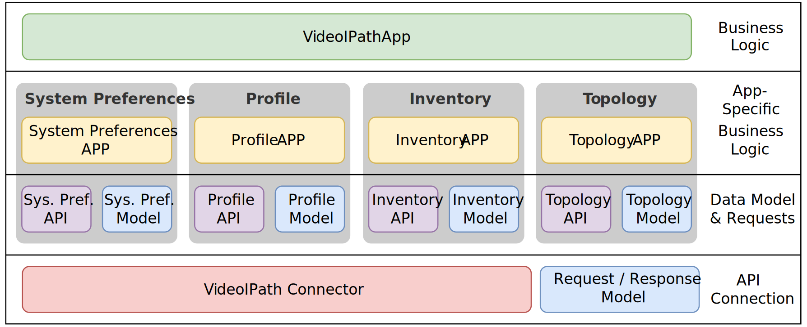

# Python Module Architecture

The architecture of this Python module is designed for **maintainability** and **extensibility**, following established principles of **modularization** and **abstraction**. This ensures a clear separation of concerns and a structured implementation.

## Architecture Overview

The module consists of multiple layers, as visualized in the diagram below:

### Business Logic Layer  

At the highest level, this layer exposes the **application interface** to users. It integrates all implemented apps and allows cross-app processes within the module.

### App Integration  

Each app follows a structured approach with three key components:

- **Model:** Defines required data models using Pydantic for validation and structured object handling.  
- **API:** Manages app-specific requests, response processing, and data validation.  
- **App:** Combines "Model" and "API" components into user-friendly methods, forming app-specific business logic.  

### Communication Layer  

At the lowest level, this layer handles fundamental methods and models for **REST and RPC API communication**. It abstracts HTTP communication, manages requests, authentication, and compression.

## Design Goals  

- Maintain a structure similar to **VideoIPath**, ensuring a familiar and intuitive user experience.  
- Provide **a consistent and simple interface** through abstraction. Provide easy-to-use methods with detailed IntelliSense support.
- **Ensure data integrity** by using Pydantic models for data validation and structured object handling.
- Hide complex API requests and validation processes from the user.  
